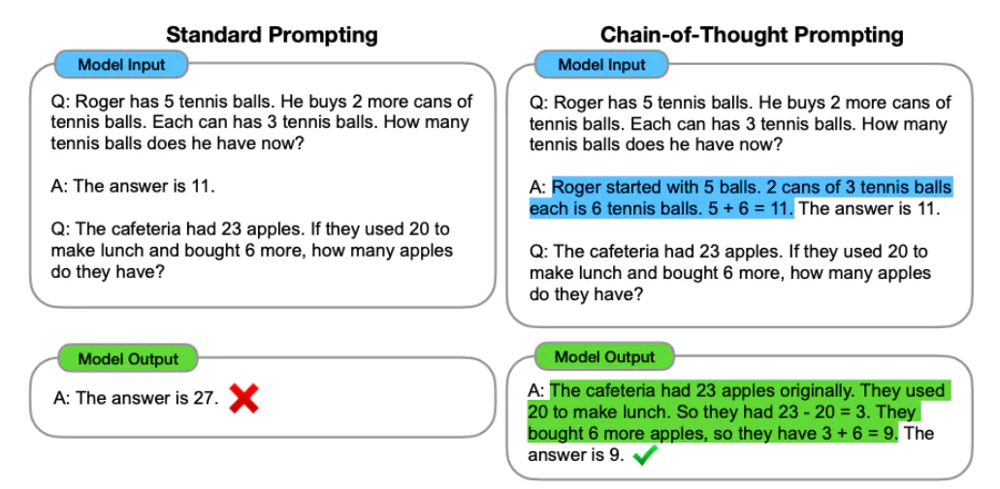
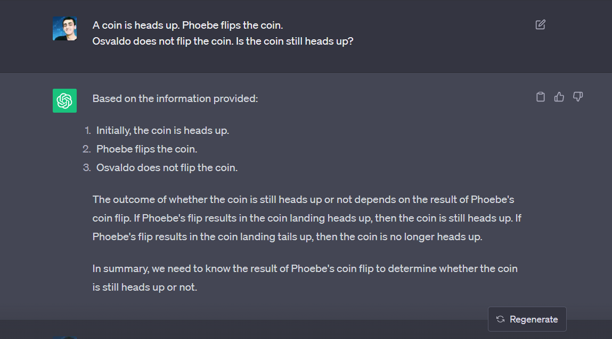

# Prompting Guide 

## Table of Contents

- [Introduction](#introduction)
- [Techniques](#techniques)
- [Models and Risks](#risks)
- [License](#license)
---

<h1 id=introduction align="center"> Introduction</h1>

<details>
  <summary>
    What is Prompt Engineering?
  </summary>
    Prompt engineering is a relatively new discipline for developing and optimizing prompts to efficiently use language models (LMs). Prompt crafting isn't just about constructing clever queries; it helps improve the capacity of LLMs on a wide range of common and complex tasks. It's the art of forging a relationship with these linguistic giants, where understanding their capabilities and limitations is just the beginning.
    
</details>

---

<h1 id=techniques align="center">Techniques</h1>


**Zero-Shot prompting:** Zero-shot prompting is a method in artificial intelligence where a language model is given a task or question without any specific training examples. Instead, it uses its pre-existing knowledge and the provided instructions to generate a response or perform the task. It's a way to make AI models more versatile and adaptable to different tasks without extensive training.

>Zero-shot prompting is like asking a very smart friend a question without giving them any background information or examples. They rely on their general knowledge and the way you phrase the question to give you an answer. It's a way for AI to answer questions or do tasks it hasn't been specifically trained for. For example, you might ask, "What are the main ingredients in pizza?" and the AI can answer without having seen a pizza recipe before.


**Few-Shot Prompting:** 

Few-shot prompting is a technique used with large-language models to improve their performance on complex tasks. While these models can do well without any prior examples (zero-shot), they struggle with more complicated tasks. Few-shot prompting involves giving the model a few examples (demonstrations) in the prompt to help it learn and generate better responses. This method becomes effective when the models are sufficiently large.

> For example, imagine we want the model to use a new word in a sentence, like "whatpu" or "farduddle." By providing a single example sentence using these words in the prompt, the model learns how to use them correctly. This process is called "1-shot" prompting. If the task is harder, we can try with more examples (e.g., 3-shot, 5-shot, 10-shot) to further improve the model's performance.

Prompt:
```
A "whatpu" is a small, furry animal native to Tanzania. An example of a sentence that uses
the word whatpu is:
We were traveling in Africa and we saw these very cute whatpus.
To do a "farduddle" means to jump up and down really fast. An example of a sentence that uses
the word farduddle is:
```
Output:
```
When we won the game, we all started to farduddle in celebration.
```
---
**Chain-of-Thought Prompting**

Chain-of-thought (CoT) prompting, introduced in Wei et al. (2022), allows for complex reasoning by breaking tasks into intermediate steps. When combined with few-shot prompting, it improves results on intricate tasks requiring reasoning.



> In the provided example, the prompt presents groups of numbers and apples. By demonstrating the reasoning process in the answer (A), the model effectively solves the task. It involves breaking down complex reasoning tasks into a series of intermediate steps or thought processes. This helps the model understand and reason through the problem step by step. It's important to note that this capability emerges in large language models, as stated by the authors.

---
See how ChatGPT answers the question with Chain of Thought purely

---

---

<h1 id=risks align="center">Models and Risks</h1>

---

<h1 id=license align="center"> License</h1>
This project is licensed under the MIT License

---
Copyright (c) 2023 Interact-Brands
---

