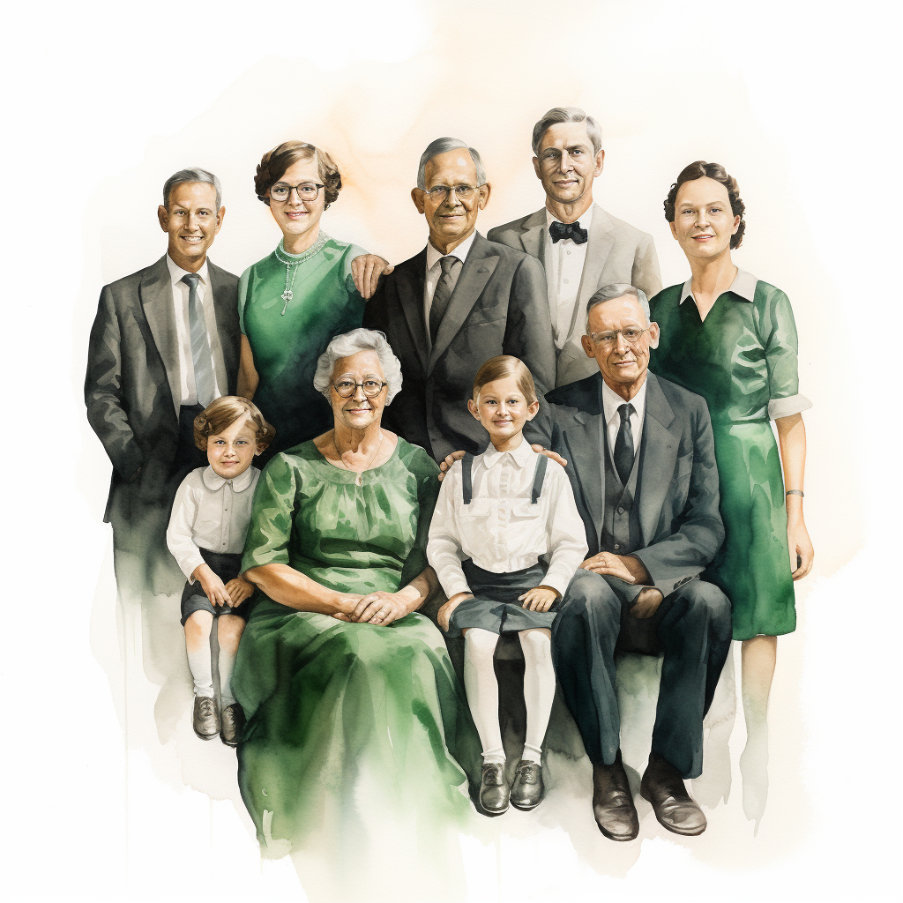
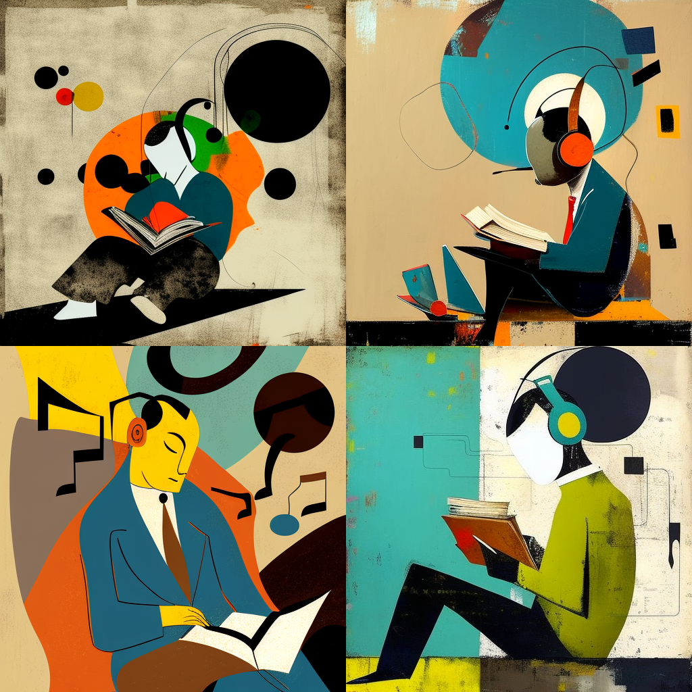
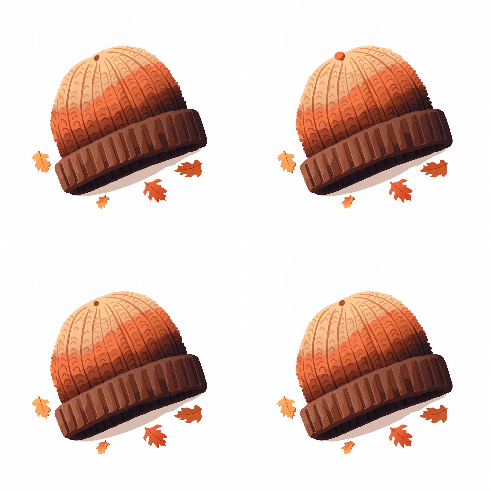

# Prompting Guide 

## Table of Contents

- [Introduction](#introduction)
- [Commands](#commands)
- [Parameters](#parameters)
- [Quick Tips](#tips)
- [High Quality Examples](#examples)
- [License](#license)
---

<h1 id=introduction align="center"> Introduction</h1>

  

    What is Prompt Engineering?
  

    Prompt engineering is a relatively new discipline for developing and optimizing prompts to efficiently use language models (LMs). Prompt crafting isn't just about constructing clever queries; it helps improve the capacity of LLMs on a wide range of common and complex tasks. It's the art of forging a relationship with these linguistic giants, where understanding their capabilities and limitations is just the beginning.
    

---
<h1 id=commands align="center">Commands</h1>

## Basic Commands
- `/ask`: Get an answer to a question.
- `/blend`: Easily blend two images together.
- `/daily_theme`: Toggle notification pings for the #daily-theme channel update.
- `/docs`: Use in the official Midjourney Discord server to quickly generate a link to topics covered in this user guide.
- `/describe`: Writes four example prompts based on an image you upload.
- `/faq`: Use in the official Midjourney Discord server to quickly generate a link to popular prompt craft channel FAQs.
- `/fast`: Switch to Fast mode.
- `/help`: Shows helpful basic information and tips about the Midjourney Bot.

## Image Generation
- `/imagine`: Generate an image using a prompt.

## Account Information
- `/info`: View information about your account and any queued or running jobs.
- `/subscribe`: Generate a personal link for a user's account page.
- `/settings`: View and adjust the Midjourney Bot's settings.

## Customization (Pro Plan Subscribers)
- `/prefer option`: Create or manage a custom option.
- `/prefer option list`: View your current custom options.
- `/prefer suffix`: Specify a suffix to add to the end of every prompt.

## Job Management
- `/show`: Use an image's Job ID to regenerate the Job within Discord.

## Mode Switching (Pro Plan Subscribers)
- `/stealth`: Switch to Stealth Mode.
- `/public`: Switch to Public Mode.
- `/relax`: Switch to Relax mode.
- `/remix`: Toggle Remix mode.

Feel free to explore these commands to enhance your experience with the Midjourney Bot!

---
<h1 id=parameters align="center">Parameters</h1>

### Basic Parameters

- `--aspect` or `--ar`: Change the aspect ratio of a generation.

### Aspect Ratios

- `--aspect` or `--ar`: Change the aspect ratio of a generation.

### Chaos

- `--chaos <number 0–100>`: Change how varied the results will be. Higher values produce more unusual and unexpected generations.

### Fast Mode

- `--fast`: Override your current setting and run a single job using Fast Mode.

### Image Weight

- `--iw <0–2>`: Sets image prompt weight relative to text weight. The default value is 1.

### Negative Prompting

- `--no`: Negative prompting, `--no plants` would try to remove plants from the image.

### Quality

- `--quality <.25, .5, or 1>`, or `--q <.25, .5, or 1>`: How much rendering quality time you want to spend. The default value is 1. Higher values use more GPU minutes; lower values use less.

### Relax Mode

- `--relax`: Override your current setting and run a single job using Relax Mode.

### Repeat Jobs

- `--repeat <1–40>`, or `--r <1–40>`: Create multiple Jobs from a single prompt. `--repeat` is useful for quickly rerunning a job multiple times.

### Seed Number

- `--seed <integer between 0–4294967295>`: The Midjourney bot uses a seed number to create a field of visual noise, like television static, as a starting point to generate the initial image grids. Seed numbers are generated randomly for each image but can be specified with the `--seed` or `--sameseed` parameter. Using the same seed number and prompt will produce similar ending images.

### Stop Parameter

- `--stop <integer between 10–100>`: Use the `--stop` parameter to finish a Job partway through the process. Stopping a Job at an earlier percentage can create blurrier, less detailed results.

### Style Options

- `--style <raw>`: Switch between versions of the Midjourney Model Version 5.1 and 5.2.
- `--style <4a, 4b, or 4c>`: Switch between versions of the Midjourney Model Version 4.
- `--style <cute, expressive, original, or scenic>`: Switch between versions of the Niji Model Version 5.

### Stylize Parameter

- `--stylize <number>`, or `--s <number>`: Parameter influences how strongly Midjourney's default aesthetic style is applied to Jobs.

### Tile Images

- `--tile`: Parameter generates images that can be used as repeating tiles to create seamless patterns.

### Turbo Mode

- `--Turbo`: Override your current setting and run a single job using Turbo Mode.

### Weird Aesthetics

- `--Weird <number 0–3000>`: Explore unusual aesthetics with the experimental `--weird` parameter.
---

Don't like your own prompts? - Use a UI tool to get help - [Prompt Helper](https://promptfolder.com/midjourney-prompt-helper)

---
<h1 id=tips align="center">Quick Tips</h1>

## 🎯 Be Precise
The more specific your prompt, the better. Instead of a generic "a cat," consider specifying "a photorealistic portrait of a tabby cat with vibrant green eyes."

## 🔑 Utilize Relevant Keywords
Incorporate keywords that provide Midjourney with a clear understanding of your desired image. Use words like "cat," "feline," "whiskers," and "paws" if you're looking for a cat image.

## ✨ Enhance with Descriptive Words
Infuse your prompt with depth and precision by using adjectives and adverbs. Request "a photorealistic portrait of a tabby cat with striking green eyes, perched on a sunlit windowsill."

## 📷 Offer Visual References
Whenever possible, provide examples to help Midjourney grasp your expectations. Include a reference image link like this: "I'd like a photorealistic portrait of a tabby cat resembling this [link to an image of a tabby cat]."

## 🧪 Experiment Freely
Don't hesitate to explore various prompts. Experimentation is key to honing your ability to create effective prompts. The more you experiment, the more proficient you'll become.

## 🎨 Align Keywords with Desired Style
If you desire an image in a specific artistic style, make sure your keywords reflect that style. For instance, if you want Midjourney to produce an image in the style of Vincent van Gogh, include keywords like "van gogh" and "impressionism" to convey your intent clearly.

---
<h1 id=examples align="center">High Quality Examples</h1>

## Hyperrealism

**Prompt Used:** 
> Hyperrealism photo of a science beaker. There are peppermint, eucalyptus, rosemary and tea tree leaves. Colors are dark gree. light green and beige. the focus is in the beaker. There is a lab and a forest in the back. there is natural light. --s 250 
---

In these types of prompts, you simply describe the primary subject(s) of the image, and Midjourney generates the image based on its interpretation. The "hyperrealistic" command is also particularly useful for making fantastical or animated characters appear real.

**Prompt Used:** 
> diorama inside a mobile phone, maximalist& hyper - detailed, modern buildings, live music show in the centre with a large crowd, Advertising photography, in the style of samyang 14mm, f/2.8 rf, hyperreal, --ar 9:16 --stylize 500 
---

## Realism with Added Context

**Prompt Used:** 
>plain white background, old, monocrome family photo, many generations, only black, white and the tones of emerald color on the whole picture, watercolor painting

If you want your realistic images to have added elements or context, you can add more information. For example, in the below image, a specific background is described instead of letting Midjourney create a generic background (such as a white background or cyberpunk distantview).

**Prompt Used:** 
>Tokyo Ginza at night in background, distant view, Hypebeast Radioactive, steampunk cat in orange Balenciaga streetwear standing with his back to the entrance of ramen shop like a human, super realistic sci - fi, cute movie, 8k--v 5.2 --ar 21:9 

## Cartoon-style

**Prompt Used:** 
>create a cartoon vector of a toddler placing items in a container, cute

These images are intended to be cartoons instead of looking realistic.

**Prompt Used:** 
>character cartoon style concept art, funny unicorn in halloween style, pen, outline --niji 5

## Pencil Drawing-style

**Prompt Used:** 
>Hyper - realistic pencil drawing, fine art, wide angle, drawing of a Harley Davidson style motorcycle, intricate details, the scene shows her confidently walking down the park boulevard, New York, anatomically perfect, ultra sharp, hyper - realistic 32k --v 5.0

Just like cartoon images, you can use "pencil-drawing style" for the appropriate effect in the image.

## Logo Design

**Prompt Used:** 
>an 8-bit logo for a data analytics company in the package transportation industry

## In the Style of a Particular Artist

**Prompt Used:** 
>lassic abstract artistic interpretation, a modern trailblazing native chinese dad, headphones on listening to music while reading a thick book, kind, gentle, educated, humble, love of music, style of Joan Miro contrast, light --upbeta --v 4 - 

You can command Midjourney to create visuals in the form of different artists and art styles. Whether you want your image to look like something Salvador Dali or Leonardo Da Vinci made, you have that option available.

## 2D Vector

**Prompt Used:** 
>8-bit pixel art of a knit hat, autumn aesthetic, simple, minimalist 2d vector, umber palette

Vector images are mathematically defined images, which makes them great for using on your website since they can be resized without losing image quality. You can generate vector images by entering the "vector" command on Midjourney.

## Film Photography

**Prompt Used:** 
>film photography of group of indigenous children watching the muppet show in pastel coloured circuss of qalapaq. Qalapaq is fictional city in antartica. The scene of the outdoor pupet show is also in pastel tones. The photography was shot in 1920's and coloured in agfa vista style

You can use film photography-style images in Midjourney, too. Simply input the aperture, ISO settings, and dimensions, and Midjourney will create the image.

## Anime and Manga

**Prompt Used:** 
>Chinese ancient style handsome man, frontal close-up, with black hair, wearing a black traditional Hanfu,Red ribbons tied to the hair, lay on a small boat in the middle of a lake, holding an antique Chinese wine jar and drinking :5, surrounded by blooming lotus flowers, with a serene facial expression, fairy air, the bright moon hangs in the night sky, the surrounding environment is illuminated by the moonlight, forming a quiet and mysterious atmosphere, delicate facial features, details painting, fantasy art, animation aesthetics, HD 8k --ar 16:9 --niji 5

If you want to create visuals for a manga or comic book, you can use the "anime" keyword in your prompts.

## Product Advertisements

**Prompt Used:** 
>vogue africa magazine photoshoot scene featuring extremely handsome muscular moroccan male models with nice pecs in moroccanpunk inspired faerietale couture and bedouin faerie faerietale couture gemstsone jewelry, inspired by the work by gualtier, by david lachapelle, by pierre et giles, photo photograph photorealistic --ar 16:9 --stylize 1000 --chaos 100 --no women, female, females, girls

You can create magazine-style photoshoot ads using Midjourney. Simply use words like "campaign" or "photoshoot" or a photographer's name, and Midjourney will generate relevant images.

---
<h1 id=license align="center"> License</h1>
This project is licensed under the MIT License

---
Copyright (c) 2023 Interact-Brands
---

