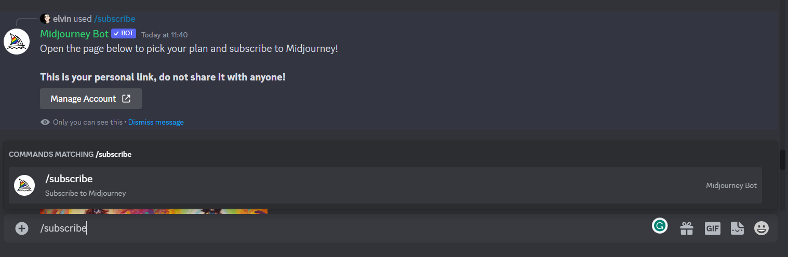

# Midjourney Guide

## Table of Contents

- [Introduction](#introduction)
- [Getting Started](#getting-started)
- [Generate Images](#generate-images)
- [Editing Images](#editing-images)
- [Effective Prompting](#effective-prompting)
- [License](#license)
---

<h1 id=introduction align="center"> Introduction</h1>

<details>
  <summary>
    What is Midjourney and Generative AI?
  </summary>

    Generative AI is like a really smart artist who can create anything you can imagine. But it's also a little bit lazy. It doesn't want to come up with new ideas all by itself, so it asks you to help it out.

    So if you want to use Generative AI, you have to be a little bit creative. You have to give it some ideas to work with, and then it will do its best to make them come to life.
    But be warned, Generative AI is not perfect. Sometimes it makes mistakes, and sometimes it creates things that are just plain weird. But that's all part of the fun.

    Midjourney is one of those generative AI tools that can create images, text, and even music. It's basically like a really powerful magic wand that can make your wildest dreams come true.
</details>

## Getting Started

### Step #1 Create a Discord account
1. Go to the [Discord website](https://discord.com).
2. Click on "Register."
3. Follow the on-screen instructions to complete the registration process.

Note: Why do we need Discord? 

Because, Midjourney does not have a website UI unlike ChatGPT. You can only access the Midjourney through Discord channels and Midjourney bot will be responding to your prompts with generated images

---

### Step #2 Join Midjourney Channel
Once you have a Discord account set up, follow these steps to join Midjourney:

1. Visit the [Midjourney website](https://www.midjourney.com).
2. Select "Join the Beta" on the website, or you can click on the Discord invite link to go directly to the Midjourney Discord channel.
[Midjourney Discord Invite](https://discord.com/invite/midjourney)
3. Accept the invitation, and you will be granted access to the Midjourney server.

---

### Step #3: Pick Your Midjourney Plan

Midjourney offers four subscription tiers, each with its own set of benefits, including access to the Midjourney member gallery, the official Discord server, general commercial usage terms, and more. For a full list of pricing plans and details, refer to the [Midjourney documentation](https://docs.midjourney.com/docs/plans) or below:


[To subscribe to a plan](https://www.midjourney.com/checkout/plans/), follow these steps:

1. Join one of the newcomer rooms in the Midjourney Discord (e.g., #newbies-106). 


2. Use the `/subscribe` command to generate a personal link to the subscription page.


3. Click on manage account and it will direct you to the plans page where you can opt for one of the four tier plans.
---

That's it! You're now ready to generate and your imagination is the limit of Midjourney.

Happy Midjourneying!

<h1 id=generate-images align="center"> Generate Images</h1>

To get started generating your first image, follow these simple steps:

1. Join one of the newcomer channels in the Midjourney Discord server. They are typically named "#newbies-" followed by a number. Don't worry too much about which one to choose; there's no real difference between them.

2. To initiate the image generation process, use Discord commands. Simply type the following command:

## How to Generate Your First Midjourney Image

Replace the example prompt with the creative idea you'd like Midjourney to turn into an image.

Here's an example of how to use the command:

```
/imagine prompt: The player is wearing an astronaut helmet, in the style of cyberpunk dystopia
```


Here's another more involved example of how to use the command:

```
/imagine prompt: A realistic landscape shot of the Northern Lights dancing over a snowy mountain range in Iceland, with long exposure to capture the motion and vibrant colors.
```


<h1 id="editing-images" align="center">Editing and Refining Images</h1>

<p align="center">Learn how to enhance and perfect your Midjourney-generated images</p>

---

<p>Once Midjourney has completed generating your image, you'll have the opportunity to refine and fine-tune it</p>

### U Buttons: Image Upscaling

>U buttons, ranging from U1 to U4, allow you to upscale an image, generating a larger version with added details.

### V Buttons: Variations

>V buttons, available from V1 to V4, create slight variations of your selected grid image. Each variation maintains the general look and composition of the original.

### 🔄 Re-roll

>You can also choose to re-run the job, which will re-initiate the original prompt and produce a fresh grid of images.

<h2 align="center">Improving Your Midjourney Prompts</h2>

<p>Enhancing your Midjourney prompts is easy. Various parameters can alter how an image generates, including aspect ratios, model versions, upscalers, and more. Parameters are added to the end of a prompt and can be combined as needed.</p>

**Example:**

```markdown
/imagine prompt: musician looking at his laptop excitedly --aspect 2:3 --stop 95 --add birds
```
<h2 align="center">Advanced Midjourney Features</h2>
<p>Take your Midjourney experience to the next level with advanced features. You can include images in your prompts to influence composition, design, and color schemes. This allows for creative freedom by combining text and image prompts or using either method independently.</p>
To use an image prompt:

Enter or paste the image's web address after the /imagine Discord command. The address must end with a .png, .gif, or .jpg extension.

Add any additional text and parameters to complete the prompt after adding the image address.
```
/imagine prompt: http://imageURL1.png description of what to imagine --parameter1 --parameter2
```

<h2 align="center">Image Prompt Rules</h2>
To effectively use image prompts, remember these key rules:

Prompts with images must start with the image web address.
For prompts to function, there must be two images or one image and text.
The image URL should end with .png, .gif, .webp, .jpg, or .jpeg.
You can obtain an image URL by right-clicking an image and selecting ‘Copy Image Address’ in most browsers.
For mobile users: A streamlined image prompting procedure is available using the /blend command.

<h2 align="center">Uploading Images from Your Device</h2>
<p>If your image resides on your computer or phone, follow these steps to include it in your prompt:</p>
Send the image to the Midjourney bot to generate a shareable link. The image address link should end with .png, .gif, .webp, .jpg, or .jpeg for compatibility.


<h1 id=effective-prompting align="center"> Effective Prompting</h1>
Tips for Using MJ (Model's Name)

1. **Word Weight:** Place crucial words early in the prompt for more influence.

2. **Breaks:** Commas are soft, `::` are hard, affecting concept blending.

3. **Adjust Weights:** Use `::n` for words and `--iw n` for images to set priorities.

4. **Aspect Ratios:** Choose carefully to avoid unwanted distortions.

5. **Reference Artists:** Mention artists for style or content guidance.

6. **Prompts Complexity:** Long prompts may yield great or nonsense results.

7. **Image + Text:** Combine to ensure key elements transfer to the image.

8. **Style Replication:** Use style images if not in MJ's reference.

9. **Specific Instructions:** Specify details when necessary.

10. **Negative Weights:** Use `--no` for exclusion.

Experiment and refine to achieve desired outcomes.

More on LLM prompting here, [Effective LLM Prompting](effective-prompting.md).


<h1 id=license align="center"> License</h1>
This project is licensed under the MIT License

---
Copyright (c) 2023 Interact-Brands
---

